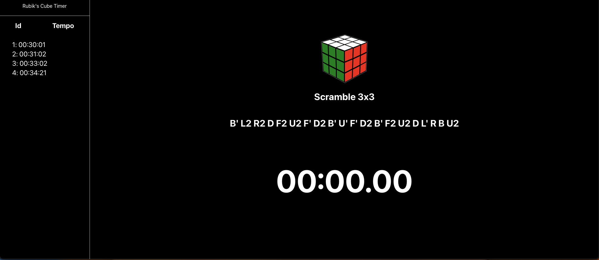

# Scramble Generator App

The Scramble App is a web application that generates random scrambles for Rubik's Cube. It provides a simple and convenient way for speedcubers and puzzle enthusiasts to practice solving the Rubik's Cube.

<blockquote style="
  border-left: 4px solid #f44336;
  padding: 10px;
  margin: 10px 0;
">
  
<strong>Note:</strong> This project was created as a demonstration of using Chat GPT as a tool for developers. It showcases how a language model like Chat GPT, powered by OpenAI, can assist in generating scrambles and providing a timer for Rubik's Cube solving.

</blockquote>

## Features

- Generates random Rubik's Cube scrambles.
- Supports standard cube sizes (e.g. 3x3).
- Includes a timer feature to time solving sessions.
- Displays the generated scramble in a user-friendly format.

## Getting Started

These instructions will help you set up and run the Scramble App on your local machine.

### Prerequisites

- Node.js (version 12 or higher)
- NPM (Node Package Manager)

### Installation

1. Clone the repository: `git clone (https://github.com/KassioVieira/scramble_generator)`
2. Navigate to the project directory: `cd scramble-generator`
3. Install the dependencies: `yarn i`

### Usage

1. Start the development server: `yarn start`
2. Open your web browser and navigate to `http://localhost:3000`

## Contributing

Contributions are welcome! If you would like to contribute to the Scramble Generator App, please follow the guidelines outlined in the CONTRIBUTING.md file.

## Contact

If you have any questions, suggestions, or issues regarding the Scramble App, please feel free to contact the project maintainer at kassio.vieira7@gmail.com
